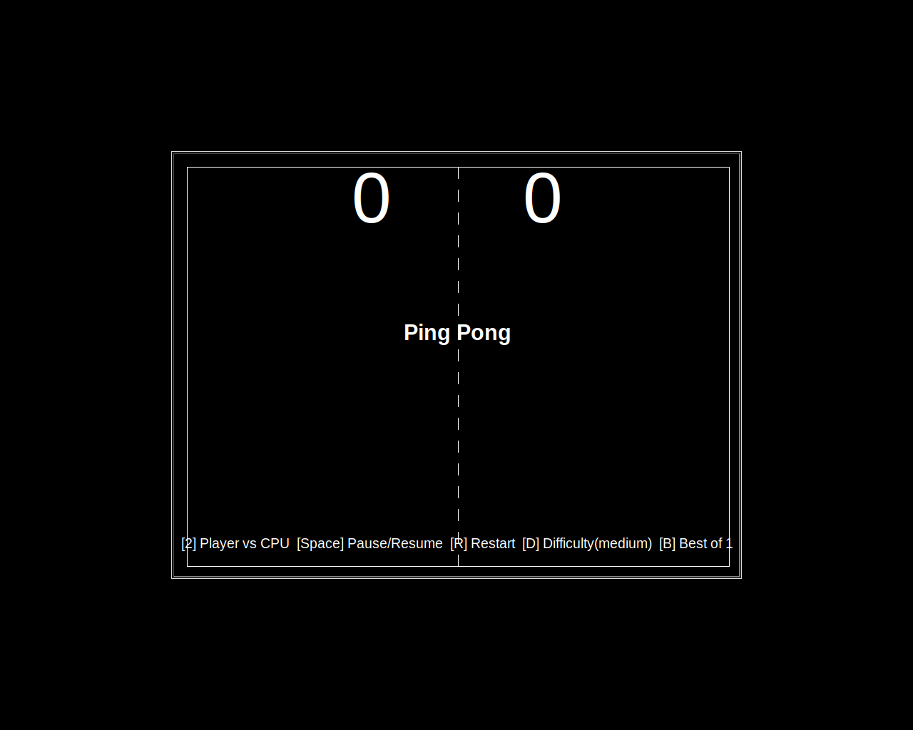
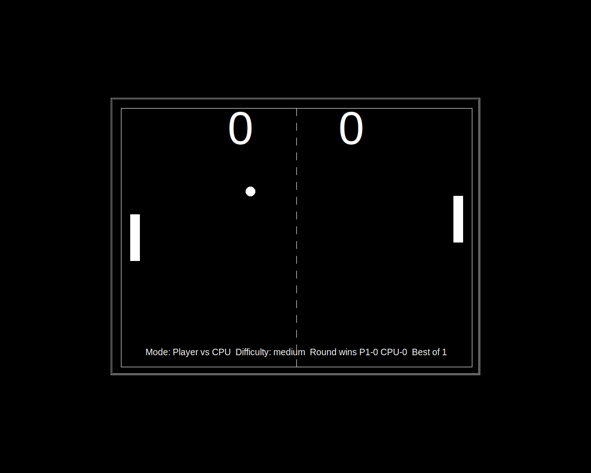
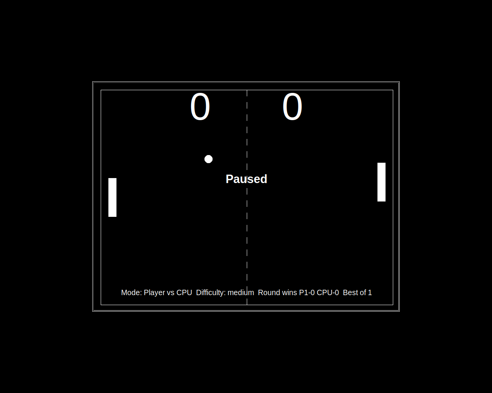

# Python Ping Pong

A detailed, player-focused Ping Pong game built with Python's `turtle` module.

## Setup

1. Make sure Python 3.10+ is installed.
2. Clone this repository.
3. From the project root, run:

```bash
python main.py
```

## What you can play

- **Player vs Player** (`1`)
- **Player vs CPU** (`2`)
- Match formats: **Best of 1 / 3 / 5**
- Difficulty presets: **easy / medium / hard**
- Game states: **start**, **playing**, **paused**, **game over**

## Controls

- `W`: Move left paddle up
- `S`: Move left paddle down
- `↑`: Move right paddle up (PVP mode)
- `↓`: Move right paddle down (PVP mode)
- `1`: Start Player vs Player
- `2`: Start Player vs CPU
- `Space`: Pause / Resume
- `R`: Restart current match
- `D`: Cycle difficulty (not while actively playing)
- `B`: Cycle Best-of format (not while actively playing)
- `Q`: Quit game

## Difficulty presets (exact values)

| Difficulty | Ball base speed (`move_speed`) | Speed growth on paddle hit (`speed_growth`) | Paddle speed (`paddle_speed`) | Points to win round (`max_score`) | CPU reaction (`cpu_reaction`) | CPU accuracy (`cpu_accuracy`) |
|---|---:|---:|---:|---:|---:|---:|
| easy | 0.12 | 0.97 | 16 | 3 | 0.09 | 0.72 |
| medium | 0.10 | 0.95 | 20 | 5 | 0.07 | 0.80 |
| hard | 0.08 | 0.93 | 24 | 7 | 0.05 | 0.90 |

## Match flow and scoring

- Each point is awarded when the ball crosses the left or right arena boundary.
- A round ends when either side reaches the current difficulty's `max_score`.
- A match ends when a side reaches the required rounds for the selected Best-of format.
- Between rounds, the game pauses and shows the round-winner banner.
- At match end, the winner banner and streak summary are shown.

## Stats saved between runs

The game stores persistent stats in `stats.json` in the project directory:

- Total matches played
- Matches won by left side
- Matches won by right side
- All-time longest streak

## Key remapping

All key bindings are centralized in `game_config.py` under `CONTROL_BINDINGS`.

## Screenshots

### Start screen



### During match (Player vs CPU)



### Paused state



## Testing

Run non-graphics unit tests with:

```bash
python -m unittest discover
```
